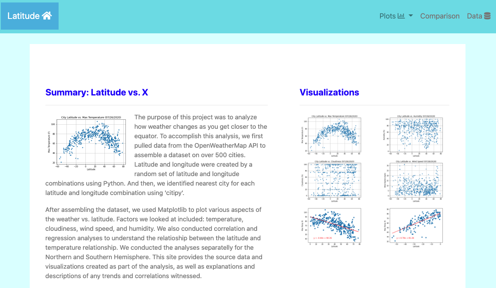
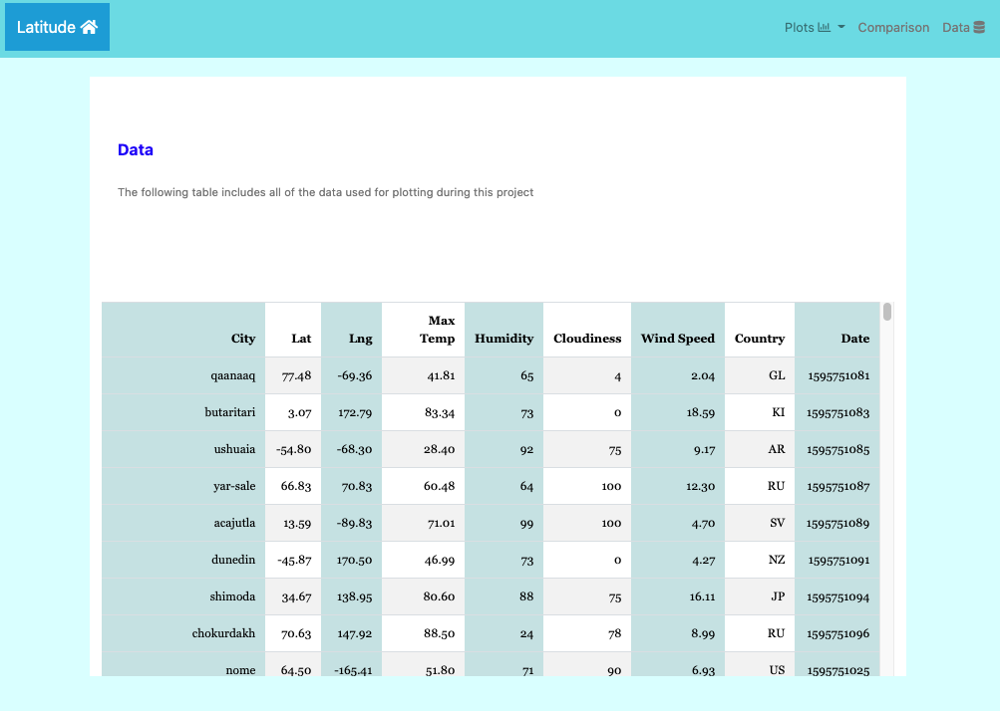
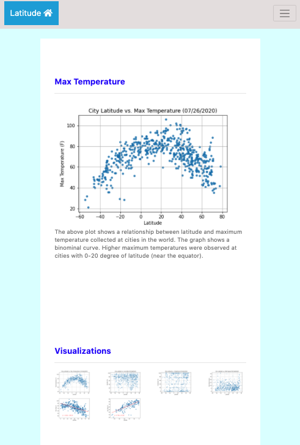

## Web-Design-Visualization Dashboard

## Latitude Analysis Dashboard

I created a visualization dashboard website using visualizations using my past project (API project). 

In building this dashboard, I created individual pages for each plot and a means by which I can navigate between them. These pages contains the visualizations and their corresponding explanations. I also made a landing page (changed the file name to index.html for deploying the file to Github), a page where I can see a comparison of all of the plots, and another page where I can view the dataset that I used for the analyses.

* Website - Opening Image (Landing page)

### Website

The website consists of 9 pages total.

* Landing page: (index page)
  * An explanation of the project.
  * Links to each visualizations page with a sidebar containing preview images of each plot, and clicking an image that takes the user to that visualization.
  
* Six visualization pages:
  * A descriptive title and heading tag.
  * The plot/visualization itself for the selected comparison.
  * A paragraph describing the plot and its significance.
  
* Comparisons page: (comparisons-page)
  * Contains all of the visualizations on the same page so I can easily visually compare them.
  * Uses a Bootstrap grid for the visualizations.
  
* Data page: 
  * Displays a responsive table containing the data used in the visualizations.

* Table Page Image

The website, at the top of every page, has a navigation menu that:

* Has the name of the site on the left of the nav which allows users to return to the landing page from any page.
* Contains a dropdown menu on the right of the navbar named "Plots" that provides a link to each individual visualization page.
* Provides two more text links on the right: "Comparisons," which links to the comparisons page, and "Data," which links to the data page.
* Is responsive (using media queries). The nav has similar behavior with the background color change.

* Web Image - Responsive with media queries

### Extra

* I used my original dataset (csv file), graphs, and table, that I created for the API Project.
* I used a Bootstrap theme to customize my website.
* I added extra visualizations - included extra two comparisons: The Northern and Southern Hemisphere Latitude vs. Max Temperature with Correlation and Regression Analyses.
* I used meaningful glyphicons next to links (latitude as a base home, plots as graphs, and data as a database) in the header.
* I have visualization navigation on every visualizations page with an active state.

Enjoy!
